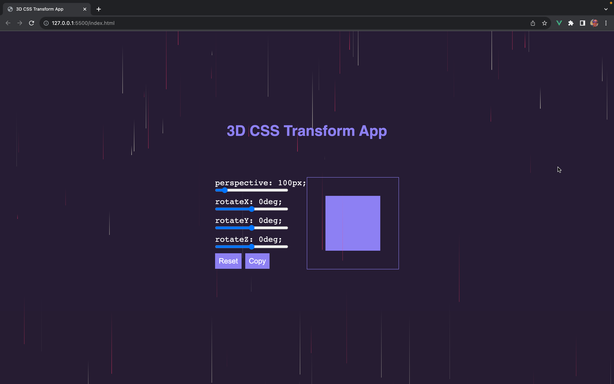

# 3D CSS Transform App

## Description

This is a Vue.js app that allows you to interactively manipulate a 3D box using CSS transforms. You can adjust the perspective, rotation on the X, Y, and Z axes, and even copy the generated CSS code to use in your projects.

## Table of Contents

- [Installation](#installation)
- [Usage](#usage)
- [Features](#features)
- [Screenshots](#screenshots)
- [Demo](#demo)
- [Technologies Used](#technologies-used)
- [Contributing](#contributing)

## Installation

To run the app locally, follow these steps:

1. Clone the repository:

   git clone https://github.com/casmir293/vue-js-3d-css-transform-app.git

2. Navigate to the project directory:

   cd vue-js-3d-css-transform-app

3. Install dependencies:

   npm install

4. Run the development server:

   npm run serve

## Usage

1. Open your web browser and go to the app's URL (e.g., http://localhost:8080).
2. Use the sliders to adjust the perspective and rotation of the 3D box.
3. Click the "Reset" button to reset the transformations to their default values.
4. Click the "Copy" button to copy the generated CSS transform code to the clipboard.

## Features

1. Interactive 3D box manipulation using CSS transforms.
2. Adjust perspective, rotateX, rotateY, and rotateZ properties.
3. Copy the generated CSS transform code with a single click.

## Screenshots

## Demo

You can see a live demo of the app [here](https://vue3d.casmir.dev).

## Technologies Used

The app is built using the following technologies:

1. Vue.js
2. CSS
3. CSS-Doodle (for the animated background)

## Contributing

I welcome contributions to improve this app! If you want to contribute, please follow these steps:

1. Fork the repository.
2. Create a new branch: git checkout -b feature/your-feature.
3. Commit your changes: git commit -m 'Add some feature'.
4. Push to the branch: git push origin feature/your-feature.
5. Submit a pull request.
